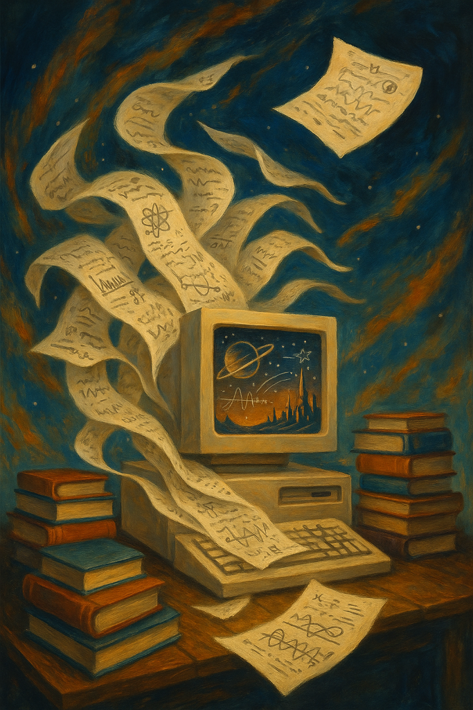

```
   ____  _                   _    __                 
  / ___|| |_ ___  _ __ _    | |  |  |_ __(_)_   ___ _ __ 
  \___ \| __/ _ \| '__| | | | |  |  | '__| | |_/ _ \ '__|
   ___) | || (_) | |  | |_| | |/\|  | |  | | ||  __/ |   
  |____/ \__\___/|_|   \__, |\__/\__/_|  |_|\__\___|_|   
                       |___/      * Science Fiction *
```

## The Quantum Resonance Project

*In the year 2157, as Earth's academic institutions crumbled beneath the weight of climate chaos, a rogue collective of scientists discovered something extraordinary: stories containing precise fluid dynamics concepts could create harmonic resonance patterns in the human brain, patterns that mirrored the mathematical structures of our universe itself.*

*What began as an experiment in educational neuroscience became humanity's most ambitious archive - embedding crucial scientific knowledge within narratives that could survive the coming dark age. Every story a time capsule. Every equation a lifeline to a future that might once again embrace understanding.*

*This repository contains the artifact of that effort - the StoryWriter system.*

## About StoryWriter

StoryWriter is a science fiction story generation system that weaves complex scientific concepts into engaging narratives. Using fluid dynamics and oceanography concepts as source material, it creates stories that are both entertaining and educational.

The system takes scientific flashcards as input and generates multi-part narratives that explain these concepts within the context of an adventure, mystery, or exploration tale.

## Repository Structure

```
storywriter/
├── data/                     # Configuration and input data
│   ├── prefix.txt            # Scientific concepts/flashcards used for context 
│   └── stories.yaml          # Story definitions in YAML format
├── docs/                     # Documentation
├── examples/                 # Example content
│   ├── example_story.txt     # Sample story format
│   └── sample_output/        # Generated sample story
├── src/                      # Source code
│   └── generate_stories.py   # Main story generation script
```

## Sample Story

This repository includes a sample generated story: "Kvothe and the Echo Beings," which incorporates concepts like Hermite polynomials in equatorial waves, filtering sound waves, constant-density approximation, primitive equations, dispersion relation and wave velocities, and shallow-water equations.

To read this story, see `examples/sample_output/Kvothe_and_the_Echo_Beings/Kvothe_and_the_Echo_Beings_full_story.txt`.

## Usage

To generate stories:

1. Configure your API key:
   ```
   export DEEPSEEK_API_KEY=your_api_key_here
   ```

2. Define stories in either `data/stories.csv` or `data/stories.yaml`

3. Run the generator:
   ```
   python src/generate_stories.py
   ```

4. Find generated stories in the `story_output/` directory

## Requirements

- Python 3.7+
- Requests library
- Internet connection (for API access)

## How It Works

The system uses the DeepSeek API to generate creative science fiction narratives based on predefined concepts. The generation process:

1. Loads scientific flashcards for context
2. Processes story definitions with titles, concepts, and descriptions
3. Makes API calls to generate story parts
4. Saves individual parts and a combined full story

Each story teaches scientific concepts through narrative, creating an intuitive understanding of complex fluid dynamics principles.



# Copyright

Copyright (c) Morgan Rivers 2025

Permission is hereby granted, free of charge, to any person obtaining a copy
of this software and associated documentation files (the "Software"), to deal
in the Software without restriction, including without limitation the rights
to use, copy, modify, merge, publish, distribute, sublicense, and/or sell
copies of the Software, subject to the following condition:

THE SOFTWARE IS PROVIDED "AS IS", WITHOUT WARRANTY OF ANY KIND.

Commons Clause License Condition v1.0

The Software is provided under the MIT License as above, with the following
modification:

The license does not grant you the right to Sell the Software or any
component thereof.

For purposes of the foregoing, “Sell” means practicing any or all of the rights
granted to you under the License to provide to third parties, for a fee or
other consideration (including without limitation fees for hosting or support
services related to the Software), a product or service whose value derives,
entirely or substantially, from the functionality of the Software.

Any licensee wishing to sell the Software must contact the licensor to obtain
a separate commercial license.

---

*"The ocean remembers the weight of what we omit." - Kvothe and the Echo Beings*
